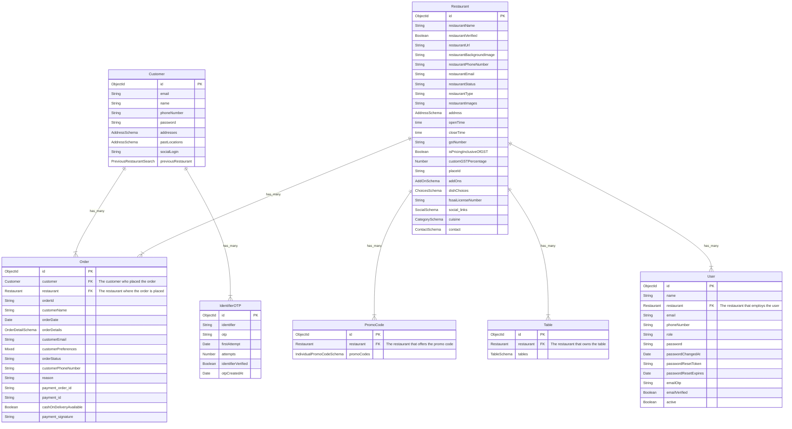
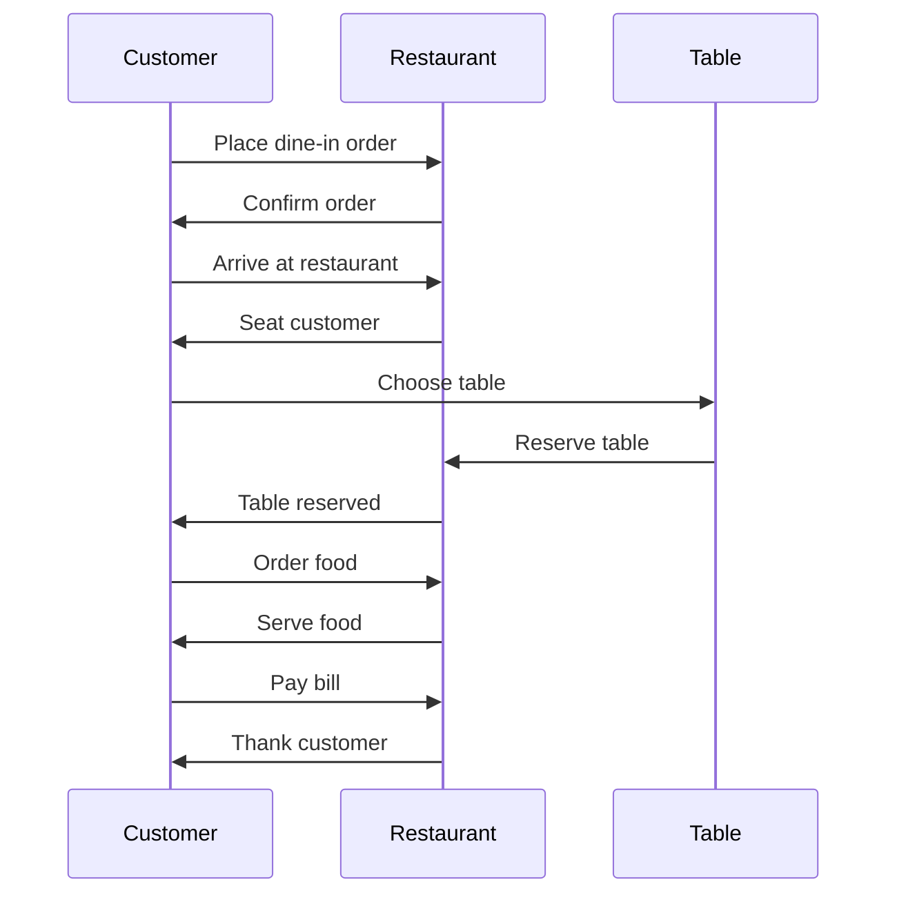
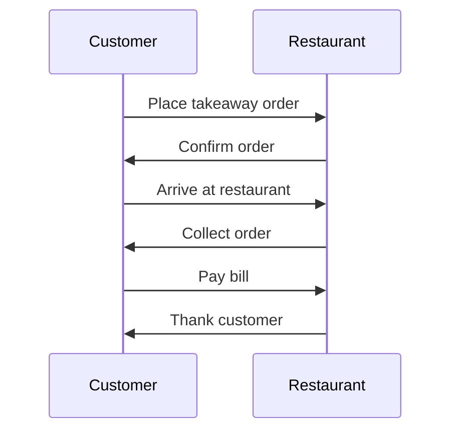
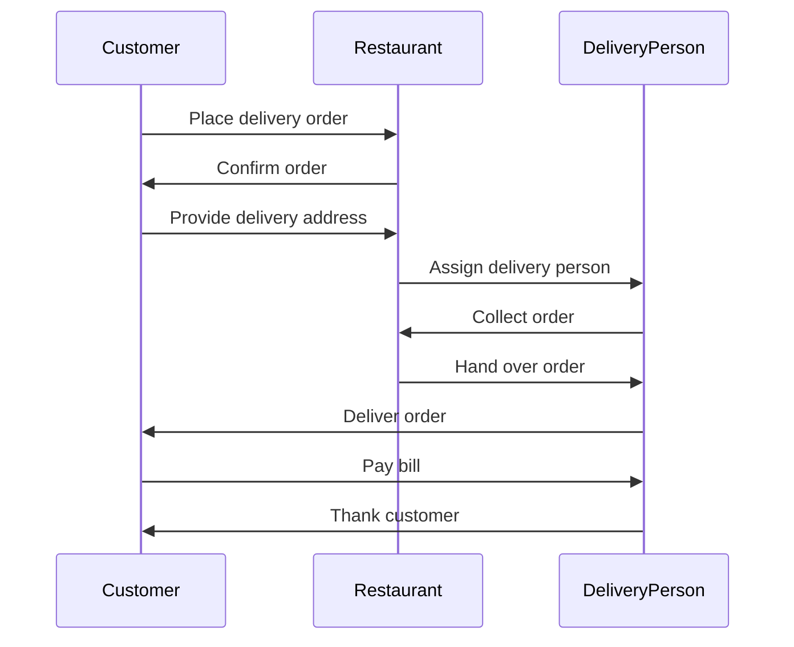
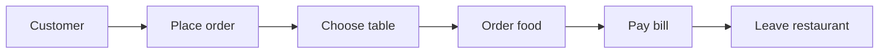
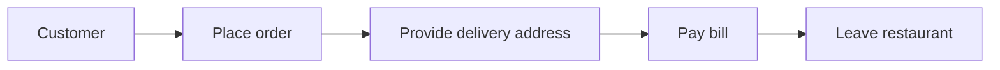
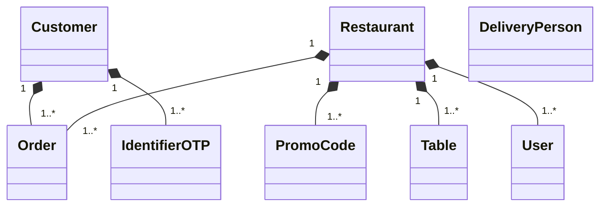

# Diagrams

## Use Case Diagrams






## Class Diagrams




```mermaid
classDiagram
    class Customer
    class Restaurant
    class DeliveryPerson
    class Order
    class Table
    class User
    class IdentifierOTP
    class PromoCode

    Customer "1" *-- "1..*" Order
    Customer "1" *-- "1..*" IdentifierOTP
    Restaurant "1" *-- "1..*" Order
    Restaurant "1" *-- "1..*" PromoCode
    Restaurant "1" *-- "1..*" Table