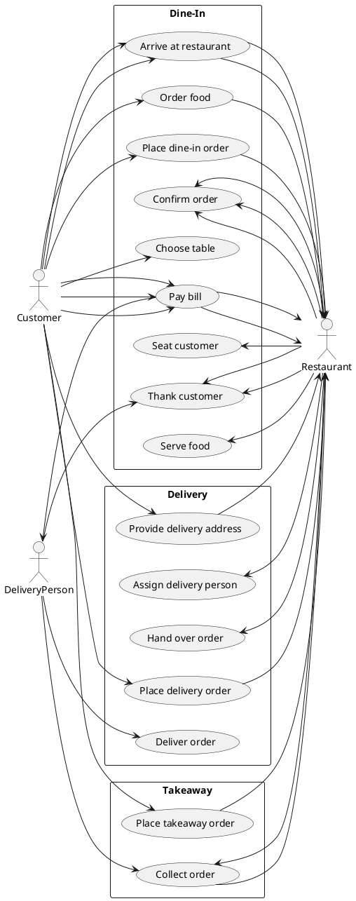
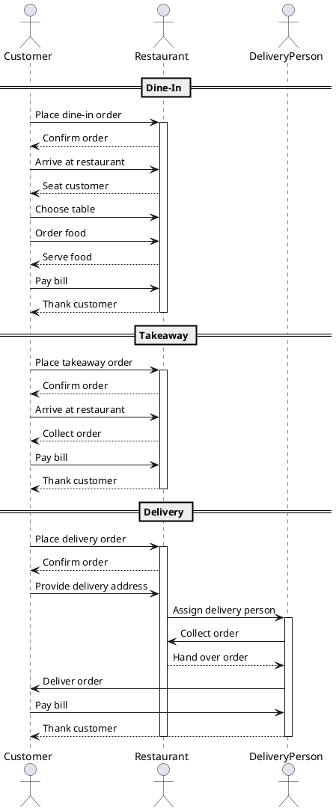
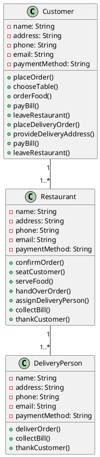
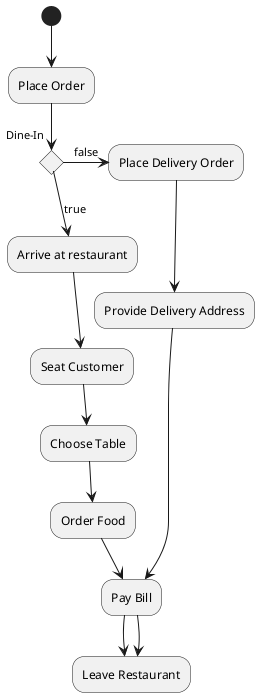

# diagrams

## Use Case Diagram

The Use Case Diagrams are Diagrams that show the interaction between the user and the system. Here we have three actors: Customer, DeliveryPerson and Restaurant. The Customer can place an order, choose a table, order food, pay the bill and leave the restaurant. The Customer can also place a delivery order, provide a delivery address, pay the bill and leave the restaurant. The DeliveryPerson can collect the order and deliver it to the customer. The Restaurant can confirm the order, seat the customer, serve the food, hand over the order, assign a delivery person, thank the customer and collect the bill.

The Use case Diagram make it easier to understand the interaction between the actors and the system.



## Sequence Diagrams



## Class Diagrams


## Activity Diagrams



## Data Flow Diagrams

```plantuml
@startuml
actor Customer as C
